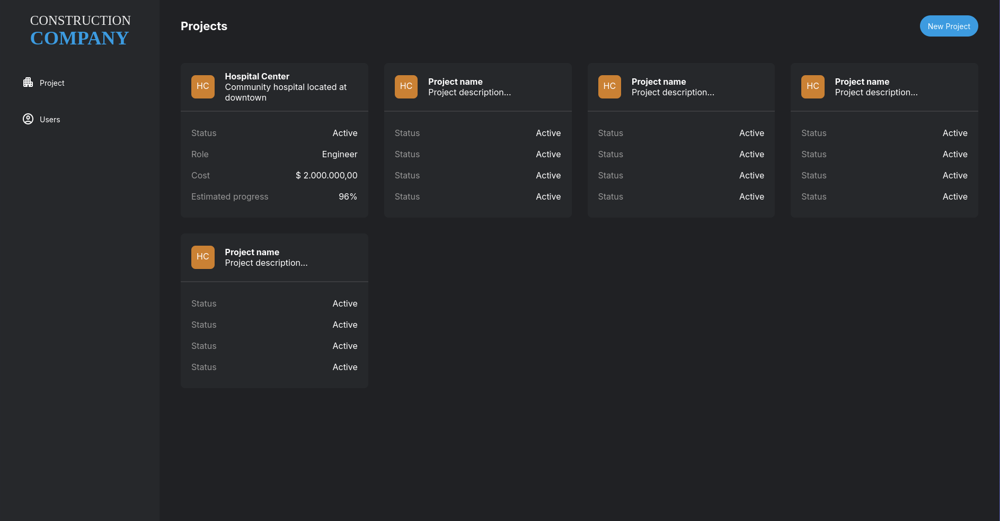
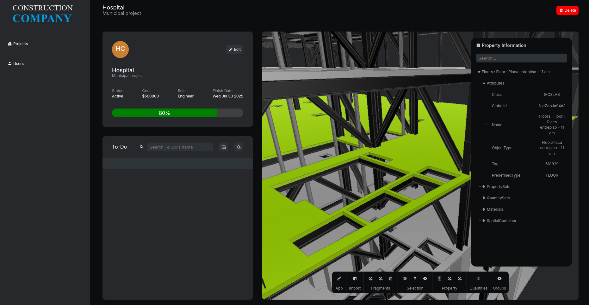

# That Open Master BIM

A powerful browser-based BIM application built with [That Open Engine](https://docs.thatopen.com/).

<div align="center">
  
  <br>
  
</div>

<div align="center">
  
  
  
  
</div>

## Features

- Project dashboard with local persistence
- IFC → Fragments conversion and fast `.frag` loading
- Element selection, properties, isolation, and visibility tools
- Length / area measurement and clipping planes
- Spatial / category classification
- Quantity take-off for the current selection
- Visual to-dos with camera bookmarks and 3D markers

## Documentation

- [FUNCTIONALITY.md](./FUNCTIONALITY.md) — what the app does and how to use it
- [CODING_STRUCTURE.md](./CODING_STRUCTURE.md) — architecture and code map
- [APP_EXPLANATION.md](./APP_EXPLANATION.md) — earlier architectural notes

## Prerequisites

- [Node.js](https://nodejs.org/) 18+
- [Yarn](https://yarnpkg.com/)

## Install & run

```shell
yarn
yarn dev
```

Then open [http://127.0.0.1:5173/](http://127.0.0.1:5173/).

Tip: open a demo project and click **Demo Model** in the viewer toolbar to load a sample Fragments building immediately.

## Stack

- React + Vite + TypeScript
- `@thatopen/components` / `@thatopen/components-front` / `@thatopen/fragments` / `@thatopen/ui` / `@thatopen/ui-obc`
- Three.js + web-ifc

## License

ISC — original course project by [Fernando Pimenta](https://github.com/pimentafm).
